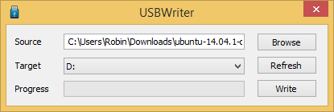
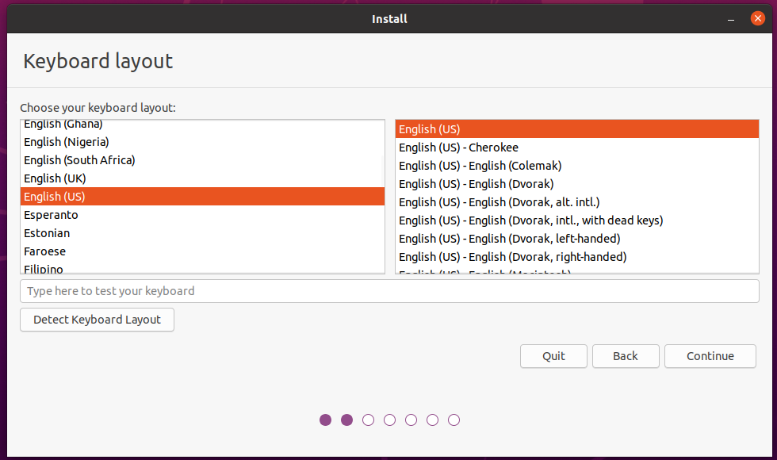

# Installatie

Op deze pagina staan alle stappen voor het installeren van Linux op jouw laptop. Lees alle tekst goed!

Je zal een USB-stick van ten minste 4 GiB nodig hebben.
Je laptop zal meerdere keren herstarten. Je kan deze pagina openen op je mobiel zodat je de instructies niet steeds hoeft op te zoeken.

## Troubleshooting
Gaat er iets mis tijdens of na de installatie? Kijk dan naar [de pagina met veelvoorkomende problemen](./troubleshooting/veelvoorkomende-problemen.md), vraag om hulp of stuur (als je thuis bent) een mailtje naar `laptops-fnwi@uva.nl`. Tijdens de introductiedag is er een ruimte beschikbaar voor als de installatie uitloopt, als je niet weet waar dit is kan je dit aan een assistent vragen.

## USB-voorbereiding
In deze stap download je het ISO-bestand voor Ubuntu desktop, en zet je deze op de usb-stick.
Zorg allereerst dat je een lege USB-stick van minstens 4 GiB hebt en voer vervolgens de volgende stappen uit:

1. Download het ISO-bestand van de 64-bit versie van Ubuntu 20.04. via de [Ubuntu website](https://ubuntu.com/download/desktop/thank-you?version=20.04.3&architecture=amd64).
2. Plug de usb-stick in.
3. Download het programma [USBWriter](http://sourceforge.net/projects/usbwriter/). USBWriter is een klein programma waarmee je de ISO naar de usb-stick kan schrijven. Na het downloaden pak je het .zip-bestand uit door rechts te klikken op het bestand, en dan "Alles uitpakken" te kiezen. Start daarna USBWriter.exe op.
4. Selecteer als "Source" het zojuist gedownloade ISO-bestand.
5. Selecteer je USB-stick als "Target" en klik op "Write". Bevestig dat je graag alle inhoud op de USB-stick wilt vernietigen.

## Fast start-up uitschakelen
*Fast start-up* is een techniek om het opstarten van Windows te versnellen, door bij het afsluiten na het beëindigen van de gebruikerssessie in sluimerstand te gaan, waarbij de systeemstaat naar de harde schijf wordt geschreven om ingeladen te worden wanneer de computer weer opstart. Fast start-up (en sluimerstand in het algemeen) maakt het onveilig om naar je Windows-partitie te schrijven vanuit Linux. Als je dit wilt doen is het dus nodig om fast start-up uit te schakelen.

Open Settings (via ⚙️ in Start), en ga naar:
* `System` / `Systeem`
* `Power & sleep` / `Energiebeheer & slaapstand` (links)
* `Additional power settings` / `Extra energieopties` (klein linkje rechts)
* `Choose what the power buttons do` / `Kies wat de aan- en uitknoppen doen` (klein linkje links)
* `Change settings that are currently unavailable` (link)
* Scroll naar beneden totdat je een lijstje met opties ziet, en schakel dan `Turn on fast start-up (recommended)` uit.
* Tenslotte klik je dan op `Save Changes` om het te bevestigen.

## BitLocker
Zie het de pagina over [BitLocker](./bitlocker.md) voor informatie over hoe je kan controleren of BitLocker ingeschakeld staat. Indien nodig, staat er ook wat je in dit geval moet doen.

## UEFI
Tegenwoordig zijn de meeste computers voorzien van een UEFI-implementatie (Unified Extensible Firmware Interface), één van de tegenhangers van het voormalige BIOS (Basic Input/Output System), die als het ware een brug vormt tussen het opstarten van de computer en het opstarten van het besturingssysteem. Het is in principe een soort configureerbaar besturingssysteem met als enige doel het opstarten van een ander volledig besturingssysteem.

### De UEFI-configuratie en het opstartmenu

De meeste UEFI-implementaties kennen een opstartmenu, waar je kan kiezen vanaf welk apparaat je een besturingssysteem wilt opstarten, en een configuratiescherm. Het is belangrijk om te weten hoe je bij beide schermen terecht kunt komen.

Voor een redelijk aantal UEFI-implementaties is er een bepaalde toetscombinatie voor het configuratiescherm, en een bepaalde toetsencombinatie voor het opstartmenu. Meestal kan je deze toetsencombinatie zien tijdens het opstarten van de laptop. Mocht dat niet het geval zijn, dan kan je altijd Google raadplegen, maar meestal is het een toets als Esc, F2, F10, F11, F12 of Delete.

Naast deze toetscombinaties is er ook via Windows de mogelijkheid om in het configuratiescherm te komen of op te starten vanaf een bepaald apparaat.

Open in Windows het startmenu. Klik op het icoontje waarmee je het systeem afsluit, herstart, etc. Houd de Shift toets ingedrukt terwijl je op de optie om te herstarten klikt. Er verschijnt dan een menu.

Om naar de UEFI-configuratie te gaan, klik op `Troubleshoot`, gevolgd door `Advanced Settings`, en dan tenslotte `UEFI Firmware Settings`. De computer zal dan herstarten, waarna het configuratiescherm verschijnt.

Om op te starten vanaf een bepaald apparaat (zoals de Ubuntu-installatie-USB) klik je op `Use a device` en kies je het apparaat vanaf waar je op wilt starten. In het geval van een USB-stick verschilt de exacte naam, maar vaak zit "USB" of de naam van de fabrikant erin.

## Opstarten
Nu je de Ubuntu-installatie op een USB-stick hebt gezet, is het tijd om de installatie vanaf de USB-stick voort te zetten.

### Opstarten vanaf de USB-stick
Sluit de USB-stick aan op de computer, en start de computer op. Als het goed is, start de computer op vanaf de USB-stick.

Mocht de USB-stick niet opstarten, dan moet de USB-stick opgestart worden via het UEFI- of BIOS-configuratiescherm. De makkelijkste manier om dat configuratiescherm op te starten is door Windows op te starten, en naar het menu te gaan waar je de computer kan uitzetten, herstarten, etc. Houd de Shift toets ingedrukt terwijl je aldaar op de optie om te herstarten klikt. Er verschijnt nu een menu met verschillende opties. Selecteer de "Use A device" optie. Daarna verschijnt er weer een menu, en kies hier de optie om van de usb stick te booten.

### Het Ubuntu-opstartkeuzemenu
Zodra je laptop is opgestart vanaf de USB-stick krijg je een keuzemenu te zien, met verschillende opties, kies hier de optie <code>Ubuntu</code> (gaat ook automatisch na een aantal seconden). Als het hierna mis gaat kan je proberen geforceerd opnieuw op te starten en <code>Ubuntu (safe graphics)</code> te selecteren in plaats van <code>Ubuntu</code>.

Wanneer Ubuntu is opgestart is kies "Install Ubuntu" en volg de instructies om het te installeren.

## De Installatiewizard
Als de installatiewizard is opgestart dan zal als eerste een taalkeuzemenu verschijnen. Hiermee wordt de taal van het besturingssysteem ingesteld dat we gaan installeren. Hier adviseren we ook om Engels te kiezen, omdat het dan makkelijker is om documentatie raad te plegen, hulp te vragen, etc.

Er zal je gevraagd worden om je toetsenbordlayout te kiezen. Als je gebruik wilt maken van de toetsencombinaties als " + e om het teken 'é' te vormen, kies dan "English (US) - English (US, intl., with dead keys)", anders kies
voor English (US). Deze keuze is altijd later aan te passen en het is dan ook mogelijk om meerdere layouts toe te voegen.

Het scherm daarna zal je vragen software van derden te installeren, vind deze aan. Waarschijnlijk wordt hier gevraagd wordt om een wachtwoord om Secure Boot te configureren. Dit wachtwoord heb je eenmalig nodig na de Ubuntu installatie (het is niet het wachtwoord van je gebruikersaccount, dat komt later).

Mogelijk krijg je hierna een waarschuwing scherm met een melding dat hij Ubuntu niet kan installeren ivm Bitlocker of Intel RST. In het geval van Bitlocker, zie de [[Bitlocker]]-pagina.
In het geval van Intel RST, vraag om hulp om dit uit te schakelen.

In het scherm daarna zal je gevraagd worden hoe je Ubuntu precies wilt installeren. Selecteer hier de optie "Install Ubuntu alongside Windows Boot Manager".

In het scherm erna kun je kiezen op welke harde schijf je Linux Ubuntu gaat installeren, en hoeveel ruimte je wilt toewijzen aan beide besturingssystemen. De installatiewizard zal je dan vragen of je zeker weet dat je wilt doen, omdat de bewerkingen die gedaan zullen worden niet ongedaan gemaakt kunnen worden. Bevestig dat je dit wilt doen. Zorg ervoor dat je Ubuntu voldoende ruimte geeft, aangezien het een uitdaging is dit later te op te hogen. Ga ervan uit dat je voor software uiteindelijk tussen de twintig en veertig gigabyte nodig gaat hebben, en ook nog gebruikersbestanden kwijt wilt. De basisinstallatie van Ubuntu neemt rond de zeven gigabyte in beslag. Het is dus verstandig om Ubuntu 50-100GB te geven afhankelijk van hoeveel capaciteit je over hebt.

De laatste paar stappen wijzen zichzelf grotendeels. Een scherm met een wereldkaart zal verschijnen; op basis van de keuze van het land zal de tijdszone, valuta, decimale scheiding et cetera bepaald worden. Hierna wordt gevraagd om enige personalia en wordt een gebruikersaccount aangemaakt. Op Linux is de voorkeur om de gebruikersnaam en de computernaam in kleine letters te schrijven (bijvoorbeeld `voornaam` en `voornaam-laptop`).

Daarna zal de installatie beginnen. Dit zal ongeveer een kwartier tot een uur duren afhankelijk van je laptop. Als de installatie klaar is zal een dialoog verschijnen met de vraag of je wilt herstarten. Herstart het systeem.

Tijdens het herstarten zal een melding verschijnen waarin staat dat je het installatiemedium moet verwijderen. Verwijder de USB-stick, en druk dan op de Enter-toets. Ubuntu zal dan opstarten.

