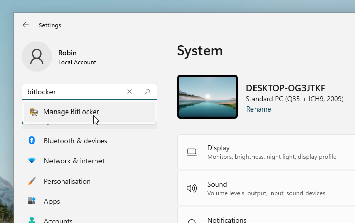
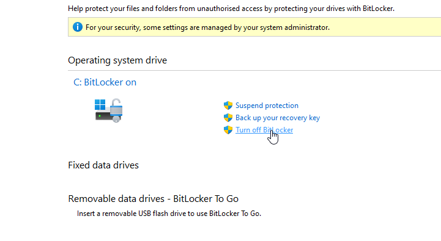
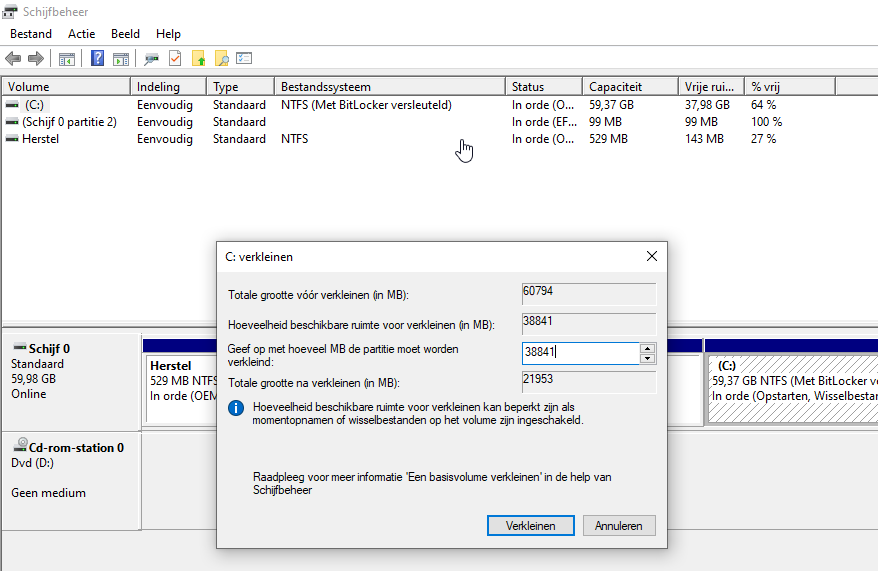

# BitLocker

**BitLocker** is een versleutelingsmechanisme van Microsoft dat de informatie op opslagmedia met behulp van encryptie onleesbaar maakt. In de context van het BYOD-programma is dit problematisch aangezien we de partitie waarop Windows draait willen verkleinen - dat kan alleen vanuit Linux als de partitie niet versleuteld is.

## Hoe weet ik of BitLocker ingeschakeld is?
In Windows kan je via het zoekmenu de BitLocker-instellingen tevoorschijn toveren. Zoek op *BitLocker* of *device encryption* (Nederlands: *apparaatversleuteling*). Hier is in te zien of BitLocker aanstaat.

Ook is het te zien in de Ubuntu-installer; Deze zal tijdens de installer een waarschuwing geven als BitLocker aanstaat:

## Installeren met BitLocker uitgeschakeld (meest eenvoudig)

Als je Ubuntu wilt installeren en niet al te veel geeft om BitLocker is het waarschijnlijk de makkelijkste manier om Ubuntu te installeren.

### Windows 10
Start Windows op, open het Settings scherm en onder about en klik op "Turn off" bij device encryption. BitLocker zal nu worden uitgeschakeld en je schijf zal worden ontsleuteld. Je krijgt een melding wanneer de ontsleuteling voltooid is, en het zal ook zichtbaar zijn in het BitLocker-configuratiescherm. Als de ontsleuteling voltooid is kan je Ubuntu op dezelfde manier installeren als normaal.

### Windows 11

In instellingen, zoek op 'BitLocker' en selecteer 'Manage BitLocker'.

Zet vervolgens BitLocker uit:

## Installeren met BitLocker ingeschakeld
### Een kopie maken van de BitLocker-herstelsleutel

!!! danger "Belangrijk"
    Als je je BitLocker-herstelsleutel niet opslaat is het mogelijk dat je je versleutelde Windows-partitie niet kunt ontsleutelen. Bewaar deze dus goed!

Het is belangrijk een kopie te maken van je BitLocker-herstelsleutel. Deze kun je als het goed is vinden in je Microsoft-account via [deze link](https://account.microsoft.com/devices/recoverykey). Als deze hier niet te vinden is, kun je hem ook lokaal vinden: in het BitLocker-venster uit de sectie hierboven zie je het item "Bitlocker settings". Klik hierop, en klik op "Back-up maken van uw herstelsleutel". Na hierop te klikken kan je kiezen om de herstelsleutel op te slaan in een bestand of af te drukken. Kies voor de laatste optie, kies dan 'Microsoft Print to PDF' en sla ergens op de schijf het PDF'je op. Open deze dan en maak een foto met je telefoon, of e-mail het naar jezelf, or whatever.

### Partitie handmatig verkleinen

Als je Ubuntu wilt installeren met BitLocker ingeschakeld, moet je enkele stappen vanuit Windows uitvoeren. Daarnaast vereist het op dit moment handmatige partitionering in de Ubuntu-installer.

Om Ubuntu te installeren met BitLocker aan moet de schijfruimte voor Ubuntu gecreëerd worden vanuit Windows; ga hiervoor naar de partitiemanager van Windows (Win+R "diskmgmt.msc"), en verklein de Windows-partitie naar de gewenste grootte.

Hierna kan opnieuw worden opgestart en de installatie van Ubuntu kan worden uitgevoerd. Tijdens het partitioneren moet je niet voor de optie "Install Ubuntu alongside Windows Boot Manager" kiezen, maar voor de optie "something else". Maak dan een partitie in de vrije ruimte met als *mount point* `/`, en klik dan op "Install now".

Als je Windows opstart via het opstartmenu van Ubuntu kan om de herstelsleutel gevraagd worden - voer deze desgevraagd in. Als het goed is wordt slechts eenmalig om de herstelsleutel gevraagd, hierna kan zonder problemen in Windows opgestart worden.
