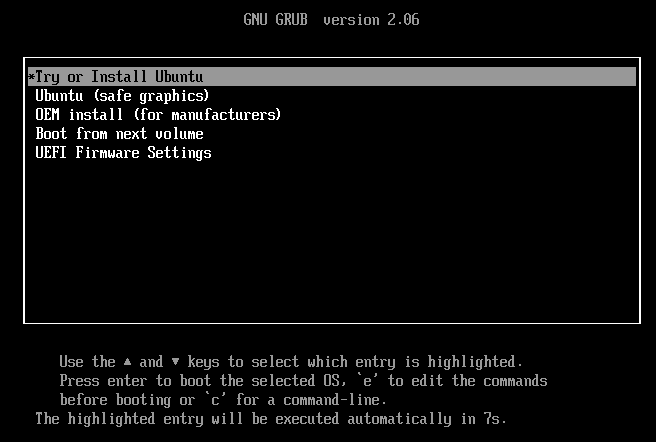
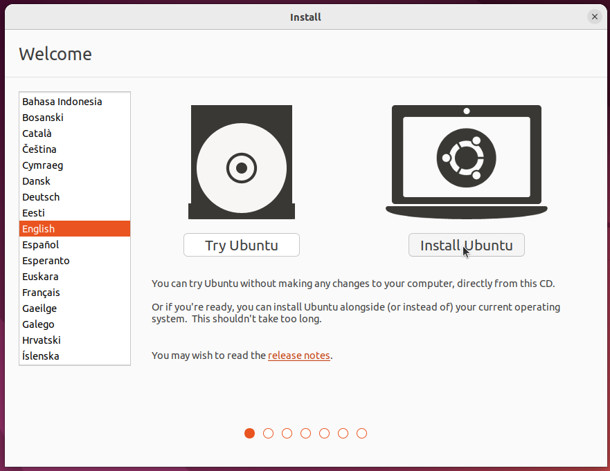
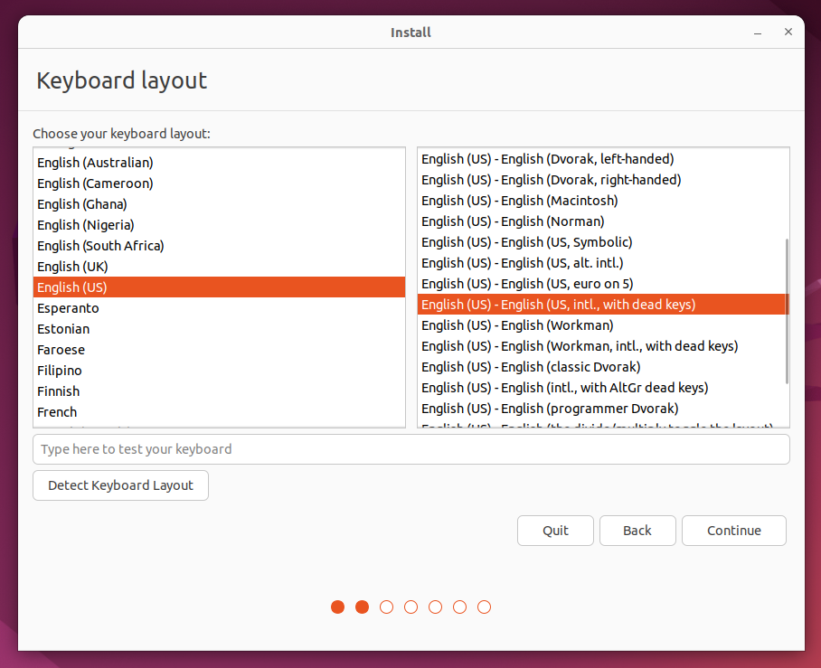
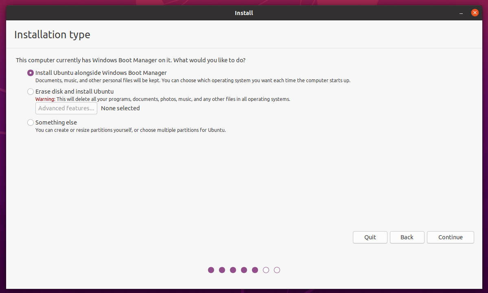
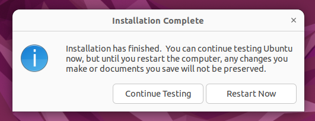
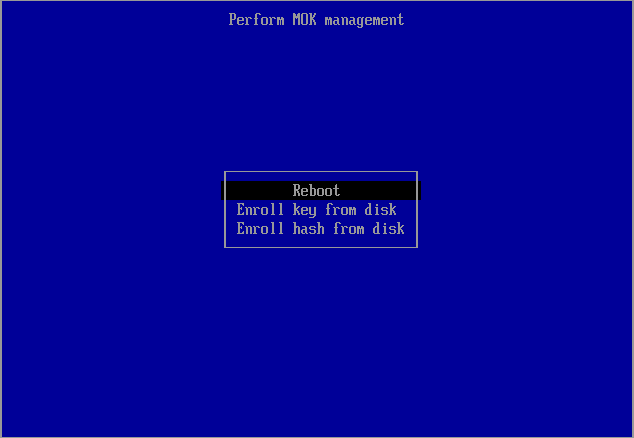

# Installatie

## Opstarten vanaf USB-stick

!!! info "Wat is UEFI?"
    Tegenwoordig zijn de meeste computers voorzien van een UEFI-implementatie (Unified Extensible Firmware Interface), één van de tegenhangers van het voormalige BIOS (Basic Input/Output System), die als het ware een brug vormt tussen het opstarten van de computer en het opstarten van het besturingssysteem. Het is in principe een soort configureerbaar besturingssysteem met als enige doel het opstarten van een ander volledig besturingssysteem.

Zorg dat je USB stick nu aangesloten is.

Nadat je een USB met Ubuntu erop gemaakt hebt, moet je laptop opstarten vanaf deze USB-stick (in tegenstelling tot de interne SSD). Er zijn verschillende manieren om dit te doen. Hieronder staan 4 manieren beschreven, kies welke het makkelijkst lijkt. Mocht het niet lukken kun je een andere methode kiezen.

1. **UEFI-opstartmenu**
    Veel laptops hebben een toets die je kan indrukken tijdens het opstarten, waardoor de laptop een opstartmenu geeft. In dit menu kan je selecteren van welk apparaat de laptop moet opstarten, in dit geval de USB-stick.

    De exacte toets kan je vinden op het internet met een zoekterm zoals "boot menu key <laptop model>".

    * Acer: <kbd>F12</kbd>
    * ASUS: <kbd>Esc</kbd> / <kbd>F8</kbd>
    * Dell: <kbd>F12</kbd>
    * HP: <kbd>Esc</kbd> / <kbd>F9</kbd>
    * Lenovo: <kbd>F12</kbd>

2. **Windows opstartmenu**
    Net als de UEFI firmware heeft Windows ook een opstartmenu.

    Open in Windows het startmenu. Klik op het icoontje waarmee je het systeem afsluit, herstart, etc. Houd de Shift toets ingedrukt terwijl je op de optie om te herstarten klikt. Er verschijnt dan een menu.

    Om op te starten vanaf een bepaald apparaat (zoals de Ubuntu-installatie-USB) klik je op `Use a device` en kies je het apparaat vanaf waar je op wilt starten. In het geval van een USB-stick verschilt de exacte naam, maar vaak zit "USB" of de naam van de fabrikant erin.

3. **UEFI firmware settings, via toets bij opstarten**
    In de UEFI firmware settings kan je de opstartvolgorde veranderen. In tegenstelling tot het opstartmenu waar je eenmalig een apparaat kiest, stel je in de UEFI firmware settings permanent[^1] een apparaat in om van op te starten.

    Net als het UEFI-opstartmenu heb je hier ook een magische toets voor nodig, te vinden op het web. De veelgebruikte toetsen:

    * Acer: <kbd>F2</kbd> / <kbd>Delete</kbd>
    * ASUS: <kbd>F2</kbd>
    * Dell: <kbd>F2</kbd>
    * HP: <kbd>F10</kbd>
    * Lenovo: <kbd>F2</kbd>

4. **UEFI firmware settings, via Windows**
    Open in Windows het startmenu. Klik op het icoontje waarmee je het systeem afsluit, herstart, etc. Houd de Shift toets ingedrukt terwijl je op de optie om te herstarten klikt. Er verschijnt dan een menu.

    Om naar de UEFI-configuratie te gaan, klik op `Troubleshoot`, gevolgd door `Advanced Settings`, en dan tenslotte `UEFI Firmware Settings`. De computer zal dan herstarten, waarna het configuratiescherm verschijnt.

Zodra je laptop is opgestart vanaf de USB-stick krijg je een keuzemenu te zien, met verschillende opties, kies hier de optie `Try or Install Ubuntu` (gaat ook automatisch na een aantal seconden). Als het hierna mis gaat kan je proberen geforceerd opnieuw op te starten en `Ubuntu (safe graphics)` te selecteren in plaats van `Ubuntu`.

## De Installatiewizard

Als de installatiewizard is opgestart dan zal als eerste een taalkeuzemenu verschijnen. Hiermee wordt de taal van het besturingssysteem ingesteld dat we gaan installeren. Hier adviseren we ook om Engels te kiezen, omdat het dan makkelijker is om documentatie raad te plegen, hulp te vragen, etc.

Kies "Install Ubuntu" en volg de instructies om het te installeren.

Er zal je gevraagd worden om je toetsenbordindeling te kiezen. Als je gebruik wilt maken van de toetsencombinaties als " + e om het teken 'é' te vormen, kies dan "English (US) - English (US, intl., with dead keys)", anders kies voor English (US). Deze keuze is altijd later aan te passen en het is dan ook mogelijk om meerdere layouts toe te voegen.

Het scherm daarna zal je vragen software van derden te installeren, vink deze aan. Waarschijnlijk wordt hier gevraagd wordt om een wachtwoord om Secure Boot te configureren. Dit wachtwoord heb je eenmalig nodig na de Ubuntu installatie bij "Perform MOK management". Het is niet het wachtwoord van je gebruikersaccount, het hoeft niet bijzonder veilig te zijn en je zult het wachtwoord hierna nooit meer nodig hebben.

Mogelijk krijg je hierna een waarschuwing scherm met een melding dat hij Ubuntu niet kan installeren ivm BitLocker of Intel RST. In het geval van BitLocker, zie de [BitLocker-pagina](./bitlocker.md).
In het geval van Intel RST, vraag om hulp om dit uit te schakelen.

In het scherm daarna zal je gevraagd worden hoe je Ubuntu precies wilt installeren. Selecteer hier de optie "Install Ubuntu alongside Windows Boot Manager".

In het scherm erna kun je kiezen op welke harde schijf je Linux Ubuntu gaat installeren, en hoeveel ruimte je wilt toewijzen aan beide besturingssystemen. De installatiewizard zal je dan vragen of je zeker weet dat je wilt doen, omdat de bewerkingen die gedaan zullen worden niet ongedaan gemaakt kunnen worden. Bevestig dat je dit wilt doen. Zorg ervoor dat je Ubuntu voldoende ruimte geeft, aangezien het een uitdaging is dit later te op te hogen. Ga ervan uit dat je voor software uiteindelijk tussen de twintig en veertig gigabyte nodig gaat hebben, en ook nog gebruikersbestanden kwijt wilt. De basisinstallatie van Ubuntu neemt rond de zeven gigabyte in beslag. Het is dus verstandig om Ubuntu 50-100GB te geven afhankelijk van hoeveel capaciteit je over hebt.

!!! info "Laptops met meerdere schijven"
    Ubuntu vraagt niet naar welke schijf de bootloader geïnstalleerd moet worden en, als je al een bestaand besturingssyteem met EFI partitie op een andere schijf hebt staan, wordt deze mogelijk overschreven! Dit is meestal geen probleem, het is juist handig. Stel je hebt Windows op schijf A en je installeert Ubuntu naar schijf B, dan wil je de GRUB op schijf A hebben zodat als je laptop vanaf schijf A opstart, GRUB je laat kiezen tussen Windows en Ubuntu. Mocht je niet willen dat je bootloader wordt overschreven, zodat je via je UEFI boot menu tussen EFI partities op de twee schijven kan kiezen, let hier wel op.

De laatste paar stappen wijzen zichzelf grotendeels. Een scherm met een wereldkaart zal verschijnen; op basis van de keuze van het land zal de tijdszone, valuta, decimale scheiding et cetera bepaald worden. Hierna wordt gevraagd om enige personalia en wordt een gebruikersaccount aangemaakt. Op Linux is de voorkeur om de gebruikersnaam en de computernaam in kleine letters te schrijven (bijvoorbeeld `voornaam` en `voornaam-laptop`).

Daarna zal de installatie beginnen. Dit zal ongeveer een kwartier tot een uur duren afhankelijk van je laptop. Als de installatie klaar is zal een dialoog verschijnen met de vraag of je wilt herstarten. Herstart het systeem.

Tijdens het herstarten zal een melding verschijnen waarin staat dat je het installatiemedium moet verwijderen. Verwijder de USB-stick, en druk dan op de Enter-toets. Ubuntu zal dan opstarten.

## Perform MOK management
Na de installatie is het mogelijk dat je een scherm krijgt met de titel "Perform MOK management" (zo niet kom je direct in GRUB terecht). Hierbij moet je kiezen voor de optie "Enroll MOK".

Kies vervolgens voor "continue".

Kies voor "yes", en voer het wachtwoord in dat je tijdens de installatie bij Configure Secure Boot hebt ingevuld. Het wachtwoord is onzichtbaar tijdens het invoeren; kijk dus niet gek op als er niets verschijnt. Als je denkt het verkeerd getypt te hebben kan je het opnieuw proberen door backspace een aantal keer in te drukken.

Hierna kies je de optie "Reboot".

Vervolgens kom je als normaal in GRUB.

## GRUB
Je komt na het opstarten als het goed is in GRUB, waar je kunt kiezen om Ubuntu of Windows op te starten. Als je Ubuntu kiest, of lang genoeg wacht, start Ubuntu op. Je kunt nu inloggen en krijgt een "What's new in Ubuntu"-scherm te zien. Hierin wordt gevraagd of je Livepatch wilt aanzetten (kan, maar hoeft niet) en of je enkele systeeminformatie door wilt sturen naar Canonical om Ubuntu te verbeteren. Je kan even naar het rapport kijken; het bevat geen gevoelige informatie, maar voel je vrij het uit te zetten.

## Software installatie

Nu Ubuntu successvol is geïnstalleerd, kan je de [shell script](./shell-script.md) gebruiken om benodigde software te installeren.

[^1]: Als je de USB-stick uit je laptop haalt, zal je laptop hoogstwaarschijnlijk automatisch de opstartvolgorde aanpassen zodat de SSD weer het primaire opstartapparaat is.
