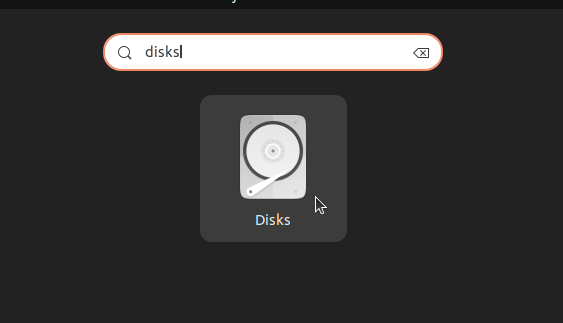
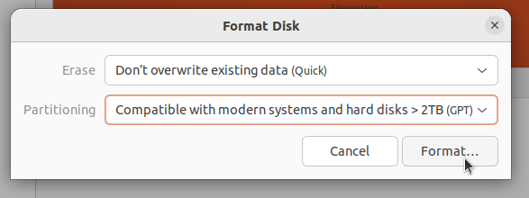
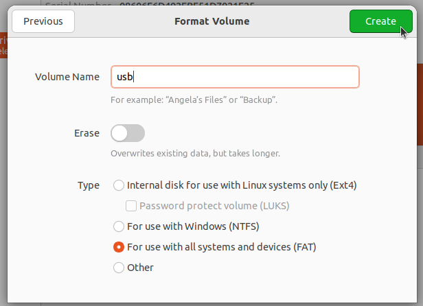
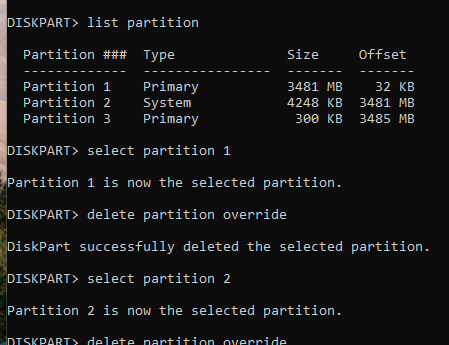

# USB herstellen

!!! hint "ISOHybrid"
    De Ubuntu ISO is een zogenaamde "ISOHybrid" iso die met DD geschreven kan worden of op de klassieke ISO manier; bestanden kopiëren naar een FAT32 partitie. Bij het schrijven in ISO modus krijg je een enkele FAT32 partitie waar Windows wel mee overweg kan, in tegenstelling tot de meerdere partities die je krijgt bij dd modus. Om deze reden raden we ook aan om ISO modus te gebruiken.

Mocht je Linux op een USB-stick hebben gezet met `dd` (of dd-modus in Rufus), heeft het een speciale partitieindeling gekregen waardoor je de USB-stick niet meer normaal kan gebruiken. Hier wordt beschreven hoe je dit ongedaan kunt maken. Dit kan op verschillende manieren, vanuit Linux of Windows.

## Ubuntu (Disks)

Open eerst de 'Disks' app:

!!! warning "Selecteer het goede station"
    Doe deze stap zorgvuldig zodat je niet per ongeluk belangrijke data vernietigd!

Selecteer je USB-stick:

Herinitialiseer de USB-stick meteen nieuw GPT partitietabel:

Nu maken we een nieuwe partitie en bestandssysteem in de lege ruimte:

## Windows (Rufus)
Open Rufus, selecteer de USB-stick en selecteer `Non bootable` voor `Boot selection`. Druk vervolgens op <kbd>START</kbd>.

## Windows (Handmatig)

Open Run, bijvoorbeeld met de toetscombinatie <kbd>Win</kbd> + <kbd>R</kbd> en voor uit: `diskpart`.

Gebruik `list disk` en `select disk <n>` om de juiste schijf de selecteren.

!!! warning "Selecteer het goede station"
    Doe deze stap zorgvuldig zodat je niet per ongeluk belangrijke data vernietigd!

Gebruik vervolgens `list partition` en dan voor elke partitie `select partition <n>`, `delete partition override` om de partities te verwijderen.

Nu zegt `list partition` als het goed is dat er geen partities zijn. Maak een nieuwe partitie met: `create partition primary`. Uiteindelijk maak je een filesystem op deze partitie met `format quick fs=fat32`. Je bent klaar! Typ `exit` om diskpart af te sluiten.
